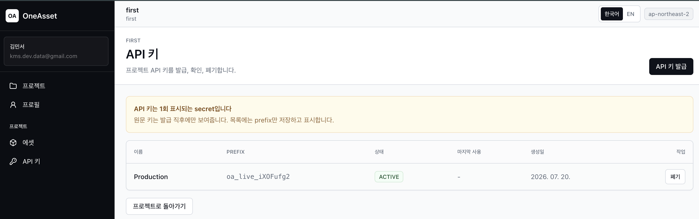
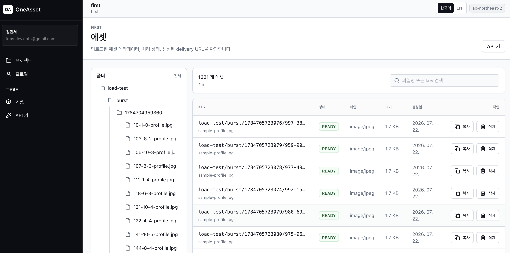
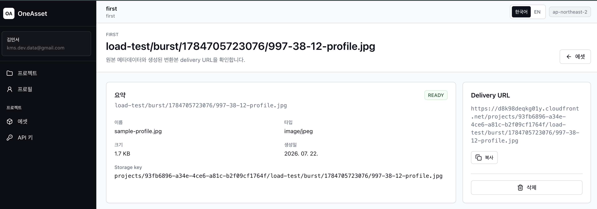
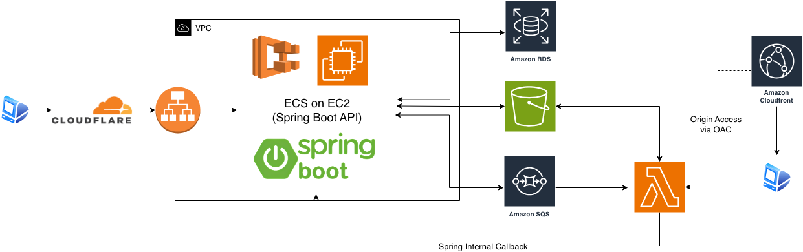
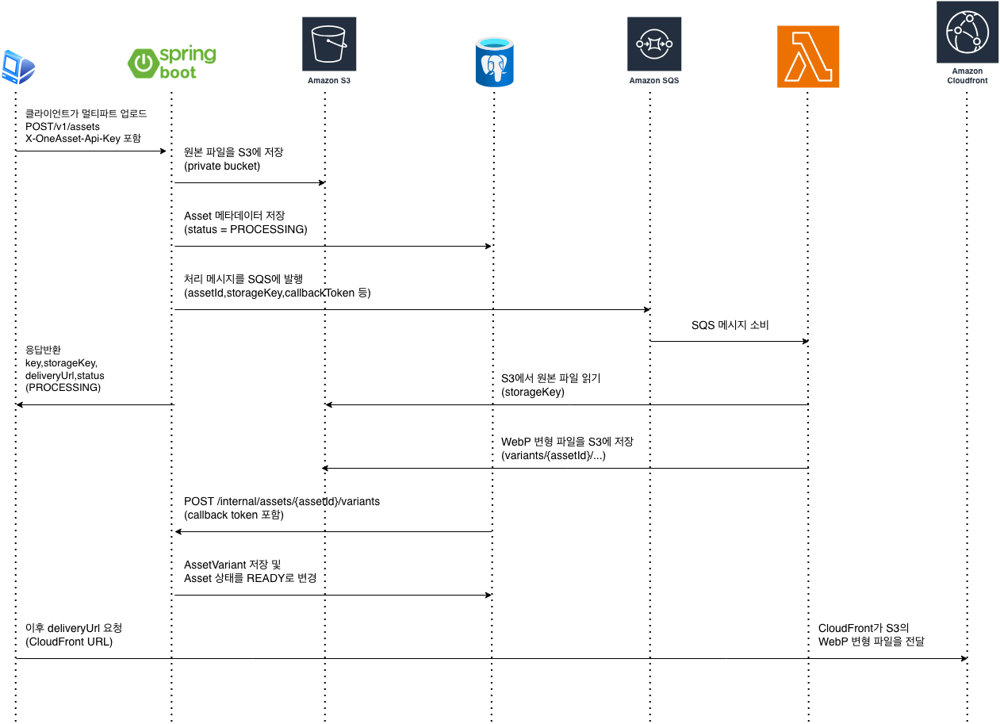
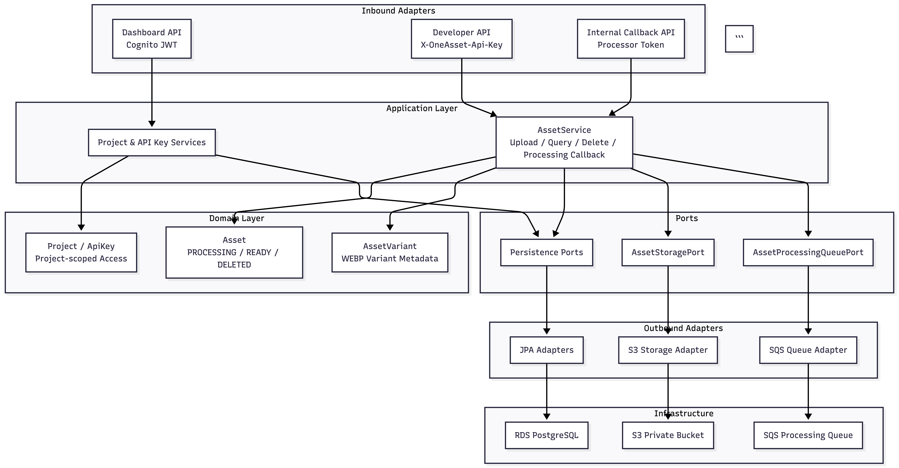
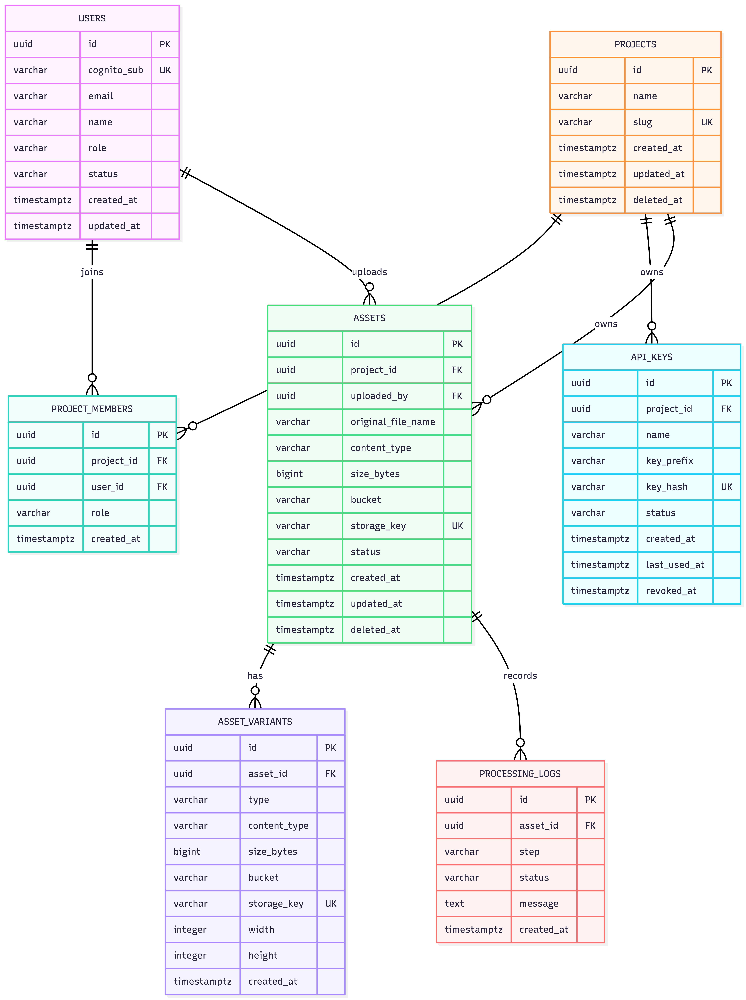
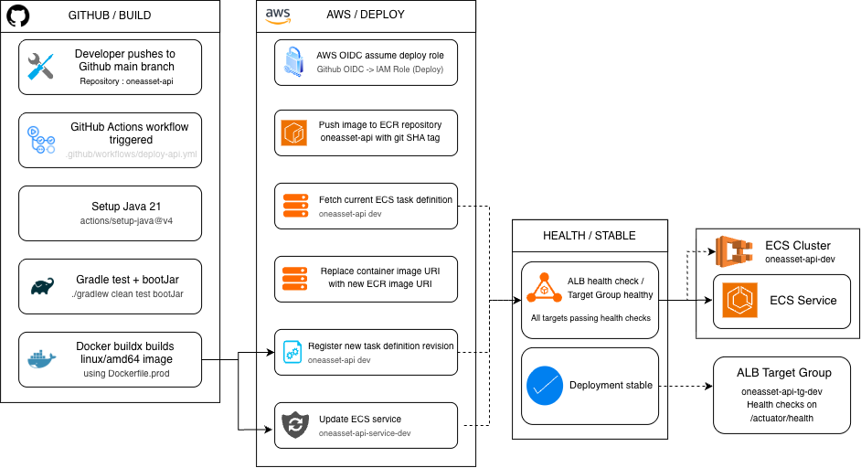
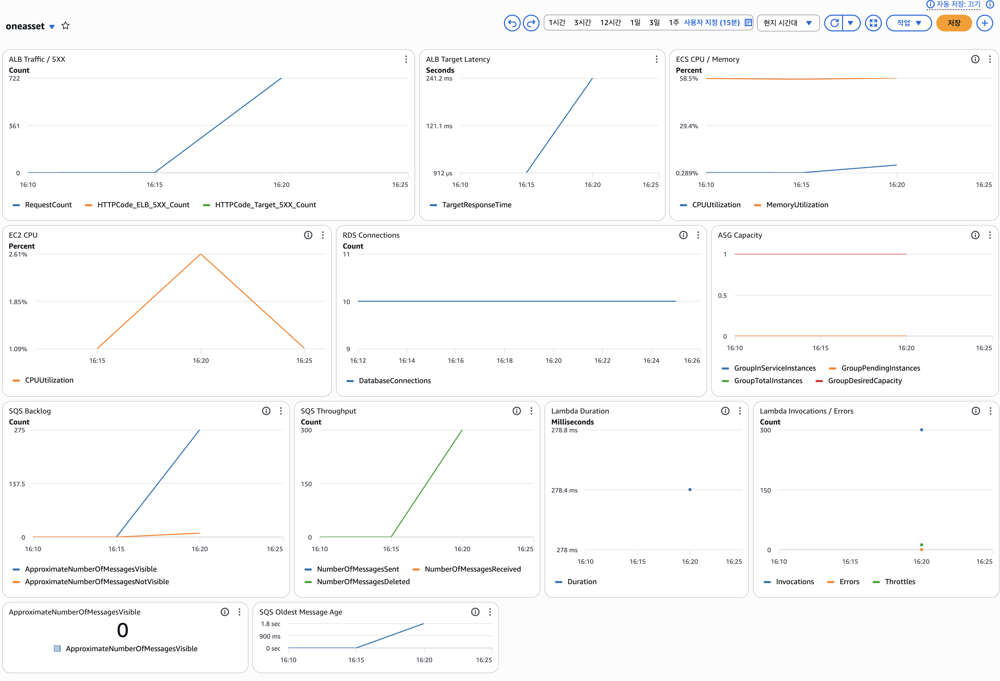

# OneAsset API

[](https://www.oracle.com/java/)
[](https://spring.io/projects/spring-boot)
[](https://aws.amazon.com/)
[](https://k6.io/)

[한국어](./README.md) · [API Docs](./docs/api/README.md) · [Load Test Report](./load-tests/README.md)

OneAsset API is a cloud-based asset management backend for developer-facing applications. It lets a project issue API keys, upload image assets, store originals in private S3, process WebP variants asynchronously, and return stable delivery URLs.

## Overview

| Area | Summary |
| --- | --- |
| Product | Developer asset upload, lookup, deletion, and delivery URL API |
| Auth | Cognito JWT for dashboard APIs, hashed API keys for developer APIs |
| Storage | Private S3 bucket for originals and variants |
| Processing | SQS queue and Lambda sharp processor |
| Runtime | Cloudflare, ALB, ECS on EC2, RDS PostgreSQL, CloudFront |
| Validation | k6 load tests and CloudWatch metrics |

## Product

<details open>
<summary><strong>Dashboard API key management</strong></summary>

<br>



API keys are shown only once as raw secrets. The server stores only the hash and prefix, and external clients call the Developer API with the `X-OneAsset-Api-Key` header.

</details>

<details>
<summary><strong>Project asset browser</strong></summary>

<br>



<br><br>



</details>

## Architecture

<details open>
<summary><strong>AWS Runtime Architecture</strong></summary>

<br>



The current runtime path is `Cloudflare -> ALB -> ECS on EC2 -> Spring Boot`. The application stores metadata in RDS PostgreSQL, uploads original objects to S3, publishes processing messages to SQS, and receives variant completion callbacks from Lambda.

CloudFront serves delivery URLs from an OAC-protected S3 origin, while direct public access to the bucket remains blocked.

</details>

<details>
<summary><strong>Asset Processing Sequence</strong></summary>

<br>



1. A developer uploads a multipart file through `POST /v1/assets`.
2. The API stores the original object in S3.
3. Asset metadata is persisted as `PROCESSING`.
4. The API publishes a processing message to SQS.
5. Lambda reads the original image and creates a WebP variant.
6. Lambda stores the variant in S3.
7. Lambda calls `/internal/assets/{assetId}/variants`.
8. The API persists `AssetVariant` and marks the asset as `READY`.

</details>

<details>
<summary><strong>Backend Architecture</strong></summary>

<br>



The backend uses a lightweight port-adapter structure. Controllers handle request authentication and command mapping, application services coordinate domain state transitions and outbound ports, and adapters isolate JPA, S3, and SQS implementation details.

</details>

<details>
<summary><strong>Data Model</strong></summary>

<br>



The core model consists of projects, API keys, assets, and asset variants. `storage_key` has a unique constraint in both asset tables to keep S3 objects and database metadata mapped one-to-one.

</details>

## API Surface

| Surface | Authentication | Purpose |
| --- | --- | --- |
| Dashboard API | Cognito JWT | Users, projects, API keys, and project assets |
| Developer API | `X-OneAsset-Api-Key` | External asset upload, lookup, and deletion |
| Internal API | `X-OneAsset-Processor-Callback-Token` | Lambda processor callbacks |

<details open>
<summary><strong>Developer Asset API</strong></summary>

```text
POST   /v1/assets
GET    /v1/assets
GET    /v1/assets?key={assetKey}
DELETE /v1/assets?key={assetKey}
```

Upload request:

```text
Content-Type: multipart/form-data
X-OneAsset-Api-Key: {raw_api_key}

file: File
key: test/profile.png
fileName: profile.png optional
```

</details>

<details>
<summary><strong>Asset Key Policy</strong></summary>

Clients work with project-local keys:

```text
test/profile.png
```

The server maps the key to a project-scoped S3 key:

```text
projects/{projectId}/test/profile.png
```

Generated variants are stored next to the original under `variants`:

```text
projects/{projectId}/test/variants/profile-w512.webp
```

</details>

## Deployment & Operations

<details open>
<summary><strong>CI/CD Pipeline</strong></summary>

<br>



```text
main push
-> test / bootJar
-> Docker buildx linux/amd64
-> ECR push
-> ECS task definition revision
-> ECS service update
-> wait service stable
```

</details>

<details>
<summary><strong>Runtime Stack</strong></summary>

| Area | Current setup |
| --- | --- |
| DNS / TLS edge | Cloudflare |
| Load balancer | Application Load Balancer |
| Compute | ECS on EC2, Auto Scaling Group, t3.small |
| Database | Amazon RDS PostgreSQL |
| Object storage | Amazon S3 private bucket |
| Queue | Amazon SQS + DLQ |
| Processor | AWS Lambda, Node.js, sharp |
| Delivery | CloudFront with Origin Access Control |

</details>

## Load Test

This README keeps only the portfolio-level summary. Detailed scenarios, commands, scripts, and interpretation notes are documented in the [Load Test Report](./load-tests/README.md).

<details open>
<summary><strong>Read Path Stress Test</strong></summary>

The read-path stress test validates the baseline stability of the `Cloudflare -> ALB -> ECS -> Spring Boot -> RDS` path. It repeatedly calls project asset list/detail APIs to measure how the common dashboard/developer read path behaves after authentication.

| Metric | Result |
| --- | --- |
| Total requests | 34,708 |
| Average throughput | 128.47 req/s |
| Failure rate | 0% |
| p95 | 414.77 ms |
| p99 | 723.49 ms |
| Max response time | 2.08 s |

This test does not validate the full async pipeline. It is a baseline for the ALB-ECS-Spring-RDS read path.

</details>

<details open>
<summary><strong>Upload Burst & Async Processing Test</strong></summary>

<br>



The upload burst test validates that the API server does not perform image transformation inline. The API stores the original object in S3, persists the asset as `PROCESSING`, publishes a message to SQS, and lets Lambda create the variant before calling the internal callback API.

| Condition | Result |
| --- | --- |
| Uploads / VUs | 300 uploads / 30 VUs |
| Upload success | 100% |
| HTTP failure | 0% |
| Upload API p95 | 1.08 s |
| READY sample success | 100% |
| READY sample p95 | 15.03 s |
| SQS visible backlog peak | about 275 |
| Lambda invocations | 300 |
| DLQ | 0 |

An additional `1000 uploads / 100 VUs` burst kept upload success and READY transition at 100%, but increased API p95 to 4.49s and READY sample p95 to 30.10s. With the test-time capacity of one `t3.small` EC2 container instance and one ECS task, the SQS/Lambda pipeline absorbed the burst without failed processing, while user-facing latency increased.

The result shows that the current architecture can absorb short upload bursts without failed processing, but stronger bursts increase API latency and time-to-READY. This gives a concrete basis for future tuning around ECS task count, Lambda concurrency, SQS backlog alarms, and RDS connection policy.

</details>

## Tech Stack

| Area | Technology |
| --- | --- |
| Language | Java 21 |
| Framework | Spring Boot 4.1 |
| Security | Spring Security, Cognito JWT, hashed API keys |
| Persistence | PostgreSQL, JPA, Flyway |
| Storage | Amazon S3 |
| Async Processing | Amazon SQS, AWS Lambda, sharp |
| Delivery | CloudFront, OAC |
| Runtime | Docker, ECS on EC2, ALB |
| CI/CD | GitHub Actions, ECR, ECS task definition revision |
| Test / Quality | JUnit, Spring Security Test, k6, Spotless, SpotBugs, JaCoCo |

## Local Development

<details>
<summary><strong>Environment Variables</strong></summary>

```text
APP_PORT=8080
POSTGRES_HOST=postgres
POSTGRES_PORT=5432
POSTGRES_DB=oneasset
POSTGRES_USER=postgres
POSTGRES_PASSWORD=postgres
COGNITO_ISSUER_URI={cognito_issuer_uri}
AWS_REGION=ap-northeast-2
ONEASSET_ASSET_BUCKET={bucket_name}
ONEASSET_DELIVERY_BASE_URL={cloudfront_base_url}
ONEASSET_ASSET_PROCESSING_QUEUE_URL={sqs_queue_url}
ONEASSET_PROCESSOR_CALLBACK_TOKEN={callback_token}
APP_CORS_ALLOWED_ORIGINS=http://localhost:5174
```

</details>

<details>
<summary><strong>Run</strong></summary>

```bash
docker compose up --build
```

```bash
./gradlew test
./gradlew compileJava
./gradlew spotlessCheck
```

</details>

## Next Improvements

- Move runtime secrets to Secrets Manager or Parameter Store
- Clean up RDS access around a dedicated ECS task security group
- Add DLQ redrive workflow and CloudWatch alarms
- Codify infrastructure with Terraform or CloudFormation
- Add usage limits, quota, and rate limiting
- Refine CloudFront custom domain and origin TLS policy
