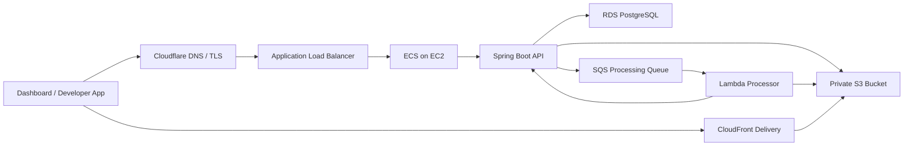

# OneAsset API

[](https://www.oracle.com/java/)
[](https://spring.io/projects/spring-boot)
[](https://aws.amazon.com/)

[English](./README.md)

OneAsset API는 개발자를 위한 클라우드 기반 에셋 플랫폼의 백엔드입니다. 프로젝트별 API Key를 발급하고, 외부 애플리케이션이 이미지를 업로드하면 원본을 private S3에 저장하고, SQS/Lambda로 변환본을 비동기 생성한 뒤 CloudFront delivery URL로 제공하는 흐름을 구현합니다.

현재 저장소는 백엔드 API와 MVP1 클라우드 파이프라인 검증에 집중합니다.

## 현재 상태

MVP1은 완료된 상태입니다.

구현된 범위:

- 프로젝트 단위 API Key 발급 및 검증
- Developer API 기반 multipart 파일 업로드
- private S3 원본 저장
- PostgreSQL 에셋 메타데이터 저장
- SQS 기반 비동기 처리 요청
- Lambda와 `sharp` 기반 WebP variant 생성
- Lambda에서 Spring Boot 내부 콜백 API 호출
- AssetVariant 저장 및 Asset 상태 `READY` 전이
- CloudFront OAC 기반 S3 delivery
- ALB 뒤 ECS on EC2 배포
- GitHub Actions 기반 ECR/ECS 배포

## 아키텍처



### 에셋 처리 흐름

```text
POST /v1/assets
-> S3에 원본 저장
-> Asset을 PROCESSING 상태로 저장
-> SQS 처리 메시지 발행
-> Lambda가 WebP variant 생성
-> variant를 S3에 저장
-> Lambda가 /internal/assets/{assetId}/variants 호출
-> Spring Boot가 AssetVariant 저장
-> Asset 상태 READY 전이
```

## API 구성

OneAsset API는 세 가지 표면으로 나뉩니다.

| 구분 | 인증 방식 | 역할 |
| --- | --- | --- |
| Dashboard API | Cognito JWT | 사용자, 프로젝트, API Key 관리 |
| Developer API | `X-OneAsset-Api-Key` | 외부 애플리케이션의 에셋 업로드/조회 |
| Internal API | Processor callback token | Lambda 처리 결과 콜백 |

### Developer Asset API

```text
POST   /v1/assets
GET    /v1/assets
GET    /v1/assets?key={userKey}
DELETE /v1/assets?key={userKey}
```

업로드 요청은 `multipart/form-data`를 사용합니다.

```text
file: File
key: users/123/profile.png
fileName: profile.png optional
```

## Asset Key 모델

클라이언트는 프로젝트 내부에서 사용할 user key만 다룹니다.

```text
users/123/profile.png
```

백엔드는 이 값을 프로젝트 ID와 결합해 실제 S3 storage key로 저장합니다.

```text
projects/{projectId}/users/123/profile.png
```

생성된 variant는 원본 경로 하위의 `variants` 디렉터리에 저장됩니다.

```text
projects/{projectId}/users/123/variants/profile-w512.webp
```

이 구조를 사용하면 외부 API 계약은 단순하게 유지하면서, 내부 저장 경로와 delivery 정책은 나중에 변경할 수 있습니다.

## 기술 스택

| 영역 | 기술 |
| --- | --- |
| Language | Java 21 |
| Framework | Spring Boot 4.1 |
| Security | Spring Security, Cognito JWT, hashed API keys |
| Persistence | PostgreSQL, JPA, Flyway |
| Storage | Amazon S3 |
| Async | Amazon SQS, AWS Lambda |
| Delivery | CloudFront with Origin Access Control |
| Runtime | Docker, ECS on EC2, ALB |
| CI/CD | GitHub Actions, ECR, ECS task definition revision |

## 로컬 개발

### 요구사항

- Java 21
- Docker, Docker Compose
- S3/SQS 연동 개발 시 AWS profile

### 실행

로컬 `.env` 파일을 준비합니다.

```text
APP_PORT=8080
POSTGRES_HOST=postgres
POSTGRES_PORT=5432
POSTGRES_DB=oneasset
POSTGRES_USER=postgres
POSTGRES_PASSWORD=postgres
COGNITO_ISSUER_URI={cognito_issuer_uri}
AWS_PROFILE=oneasset-dev
AWS_REGION=ap-northeast-2
ONEASSET_ASSET_BUCKET={bucket_name}
ONEASSET_DELIVERY_BASE_URL={cloudfront_base_url}
ONEASSET_ASSET_PROCESSING_QUEUE_URL={sqs_queue_url}
ONEASSET_PROCESSOR_CALLBACK_TOKEN={local_callback_token}
```

애플리케이션과 PostgreSQL을 실행합니다.

```bash
docker compose up --build
```

주요 확인 명령:

```bash
./gradlew test
./gradlew compileJava
./gradlew spotlessCheck
```

## 배포

`main` 브랜치 push 시 GitHub Actions가 배포를 수행합니다.

```text
main push
-> test 및 bootJar 빌드
-> linux/amd64 Docker image 빌드
-> ECR push
-> ECS task definition 새 revision 등록
-> ECS service update
-> service stable 대기
```

현재 런타임 구조:

```text
Cloudflare
-> ALB
-> ECS on EC2
-> Spring Boot
-> RDS / S3 / SQS
-> Lambda processor
-> CloudFront delivery
```

## MVP1에서 확인한 문제

MVP1 구현 과정에서 실제 운영에 가까운 문제들을 확인했습니다.

- ECS Task가 배치되는 서브넷과 ALB 활성 AZ가 일치해야 합니다.
- private subnet의 ECS Task는 Cognito metadata와 AWS API 접근을 위해 outbound 경로가 필요합니다.
- Lambda 기본 timeout 3초는 이미지 처리에 부족합니다.
- Lambda callback token은 Lambda와 ECS 양쪽 환경변수가 일치해야 합니다.
- RDS 보안그룹은 넓은 default SG가 아니라 실제 ECS Task/Service SG를 허용하도록 정리해야 합니다.

## 다음 단계

MVP2:

- 에셋 키 기반 Dashboard tree view
- 여러 variant 타입과 처리 옵션
- 처리 실패 가시화와 DLQ 복구 흐름
- AWS Secrets Manager 또는 Parameter Store 기반 secret 정리
- 반복 가능한 환경 구성을 위한 Infrastructure as Code

MVP3:

- 환경 분리 강화
- 배포 다운타임 감소
- 사용량 제한, abuse protection, 운영 지표
- 외부 개발자 문서화
