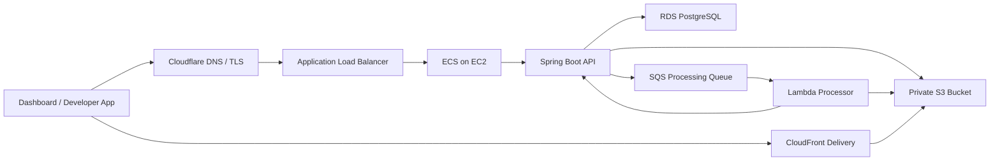

# OneAsset API

[](https://www.oracle.com/java/)
[](https://spring.io/projects/spring-boot)
[](https://aws.amazon.com/)

[한국어](./README.ko.md)

OneAsset API is the backend for a cloud-native asset platform. It lets a project issue API keys, upload image assets, store originals in private S3, process variants asynchronously, and serve stable delivery URLs through CloudFront.

The current repository is focused on the backend API and the MVP1 cloud pipeline.

## Status

MVP1 is complete.

The implemented flow proves:

- Project-scoped API key issuance and validation
- Multipart asset upload through the Developer API
- Private S3 original storage
- PostgreSQL metadata persistence
- SQS-based asynchronous processing
- Lambda image variant generation with `sharp`
- Internal processor callback into Spring Boot
- CloudFront delivery through OAC-protected S3 access
- ECS on EC2 deployment behind an ALB
- GitHub Actions deployment to ECR and ECS

## Architecture



### Asset Processing Flow

```text
POST /v1/assets
-> store original object in S3
-> save Asset as PROCESSING
-> publish processing message to SQS
-> Lambda creates a WebP variant
-> Lambda stores the variant in S3
-> Lambda calls /internal/assets/{assetId}/variants
-> Spring saves AssetVariant
-> Asset becomes READY
```

## API Surface

OneAsset has two API surfaces.

| Surface | Authentication | Purpose |
| --- | --- | --- |
| Dashboard API | Cognito JWT | User, project, and API key management |
| Developer API | `X-OneAsset-Api-Key` | External application asset upload and lookup |
| Internal API | Processor callback token | Lambda-to-API processing callbacks |

### Developer Asset API

```text
POST   /v1/assets
GET    /v1/assets
GET    /v1/assets?key={userKey}
DELETE /v1/assets?key={userKey}
```

Upload requests use `multipart/form-data`.

```text
file: File
key: users/123/profile.png
fileName: profile.png optional
```

## Asset Key Model

Clients work with a project-local user key:

```text
users/123/profile.png
```

The backend stores objects under a project-scoped S3 key:

```text
projects/{projectId}/users/123/profile.png
```

Generated variants are stored next to the original under a `variants` directory:

```text
projects/{projectId}/users/123/variants/profile-w512.webp
```

This keeps the public API stable while allowing storage layout and delivery policy to evolve.

## Tech Stack

| Area | Technology |
| --- | --- |
| Language | Java 21 |
| Framework | Spring Boot 4.1 |
| Security | Spring Security, Cognito JWT, hashed API keys |
| Persistence | PostgreSQL, JPA, Flyway |
| Storage | Amazon S3 |
| Async | Amazon SQS, AWS Lambda |
| Delivery | CloudFront with Origin Access Control |
| Runtime | Docker, ECS on EC2, ALB |
| CI/CD | GitHub Actions, ECR, ECS task definition revision |

## Local Development

### Requirements

- Java 21
- Docker and Docker Compose
- AWS profile for S3/SQS-backed development

### Run Locally

Create a local `.env` file.

```text
APP_PORT=8080
POSTGRES_HOST=postgres
POSTGRES_PORT=5432
POSTGRES_DB=oneasset
POSTGRES_USER=postgres
POSTGRES_PASSWORD=postgres
COGNITO_ISSUER_URI={cognito_issuer_uri}
AWS_PROFILE=oneasset-dev
AWS_REGION=ap-northeast-2
ONEASSET_ASSET_BUCKET={bucket_name}
ONEASSET_DELIVERY_BASE_URL={cloudfront_base_url}
ONEASSET_ASSET_PROCESSING_QUEUE_URL={sqs_queue_url}
ONEASSET_PROCESSOR_CALLBACK_TOKEN={local_callback_token}
```

Start the app and PostgreSQL:

```bash
docker compose up --build
```

Useful checks:

```bash
./gradlew test
./gradlew compileJava
./gradlew spotlessCheck
```

## Deployment

Deployment is handled by GitHub Actions on `main`.

```text
push to main
-> run tests and build bootJar
-> build linux/amd64 Docker image
-> push image to ECR
-> register a new ECS task definition revision
-> update ECS service
-> wait for service stability
```

Runtime infrastructure is currently configured as:

```text
Cloudflare
-> ALB
-> ECS on EC2
-> Spring Boot
-> RDS / S3 / SQS
-> Lambda processor
-> CloudFront delivery
```

## Lessons Captured

The MVP1 build surfaced several production-shaped problems:

- ECS task placement depends on enabled ALB Availability Zones.
- Private subnet tasks need outbound access for Cognito metadata and AWS APIs.
- Lambda defaults, especially timeout, are too small for image processing.
- Processor callback authentication must be configured on both Lambda and ECS.
- RDS security groups should allow the actual task/service security group, not a broad default group.

These findings are being folded into the next infrastructure cleanup pass.

## Roadmap

MVP2 focus:

- Dashboard asset browser with tree rendering by asset key
- Multiple variant types and processing options
- Processing failure visibility and DLQ recovery workflow
- Cleaner secret management with AWS Secrets Manager or Parameter Store
- Infrastructure-as-code for repeatable environments

MVP3 focus:

- Stronger environment separation
- Deployment downtime reduction
- Usage limits, abuse protection, and operational metrics
- Public developer documentation
