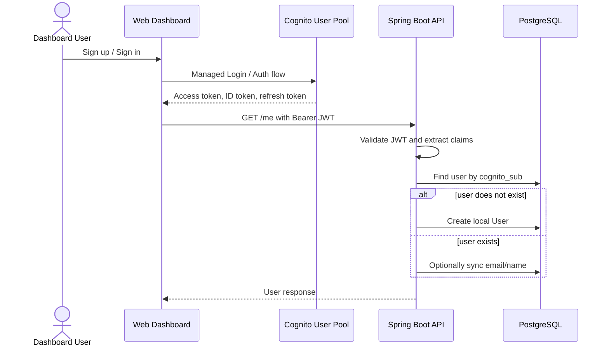
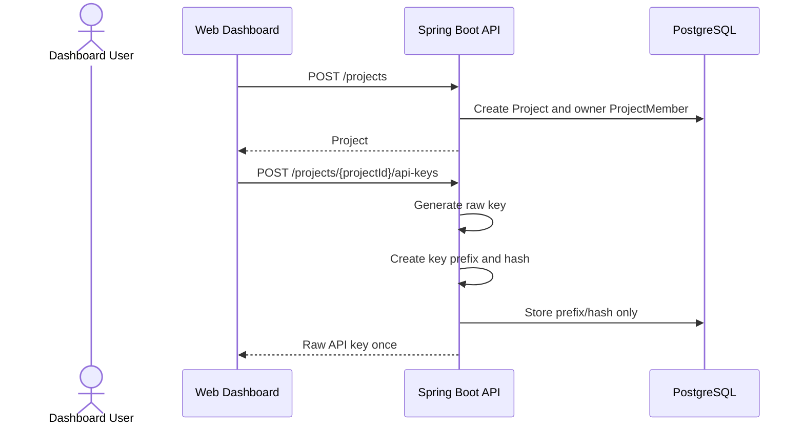
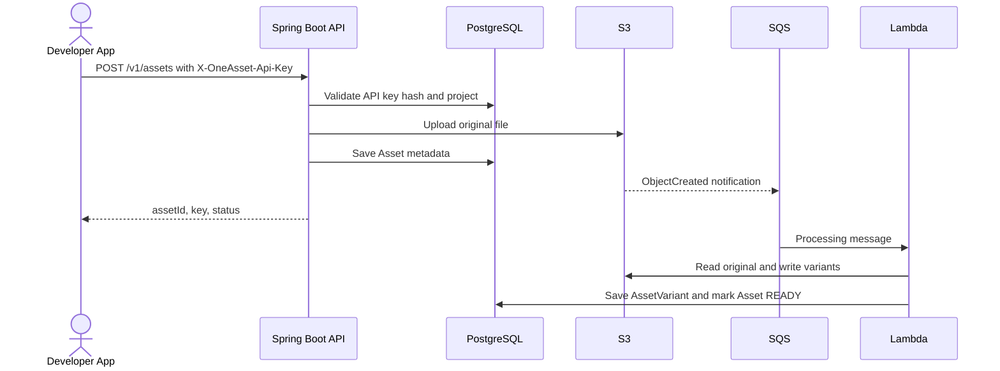

# Runtime Flows

## 역할

런타임에서 여러 컴포넌트가 어떤 순서로 상호작용하는지 기록한다.

## Dashboard Login and Lazy User Sync

로컬 User 생성은 Cognito 회원가입 순간이 아니라, 인증된 사용자가 OneAsset 보호 API에 처음 진입하는 시점에 수행한다.

## Project and API Key Flow

## Asset Upload and Processing Flow

## 업데이트 시점

- 요청 흐름이 바뀔 때
- 동기/비동기 경계가 바뀔 때
- 외부 시스템 호출 위치가 바뀔 때

## 작성 형식

가능하면 Mermaid sequence diagram을 사용한다.
